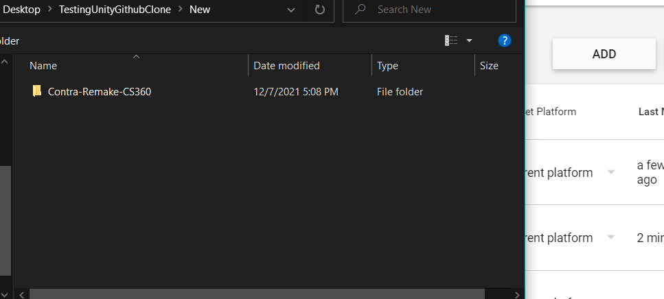
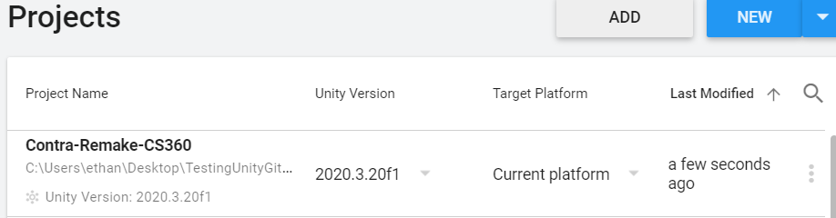
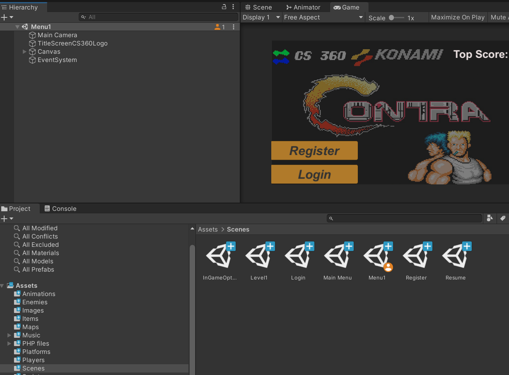

# Contra-Remake-CS360

The master branch contains the actual project files and the main branch contains the documentation for the project.
This documentation includes a feasibility study, weekly progress reports, and other sprint documenatation.

## Build Instructions 

To continue developent on our CS360 project you will need git and the unity editor and hub.
[Unity Install](https://unity3d.com/get-unity/download)

Make sure git displays a version number.
```
git --version
```

Clone our repository into a new directory.
```
git clone https://github.com/eldm-ethanmoore/Contra-Remake-CS360.git
```

Add the cloned repo to your unity hub.   



Click on added repo.   



Make sure to add the Menu1 scene and remove the default scene by right clicking and remove scene.   




## Contact Me!
Author: Ethan Moore, Aman Patel, Will Craddock   
Email: eldm2350@protonmail.com, William.Craddock123@wku.edu, aman.patel689@topper.wku.edu
Github: https://github.com/eldm-ethanmoore 
